# sysbox

macOS 与 Windows 上的终端系统维护工具箱，集中处理开发缓存清理、容器管理、进程排查、网络诊断、磁盘分析、服务管理和工具更新。

## 功能

| 分类 | 工具 | 主要功能 |
|---|---|---|
| 清理 | JetBrains 缓存 | 清理 IDE 索引、编译缓存与日志 |
| 清理 | VS Code 系编辑器 | 清理 VS Code、Cursor、Windsurf、Trae 等编辑器的缓存、旧扩展与旧服务端 |
| 清理 | Agent 垃圾 | 清理 Claude、Codex、OpenCode 等工具的过期缓存与旧版本 |
| 清理 | 开发缓存 | 清理 Go、npm、pnpm、pip、uv、Gradle、Maven、Cargo 等开发工具的缓存 |
| 清理 | 项目构建产物 | 查找旧项目中的 node_modules、target、build、.venv 等产物 |
| 工具 | Docker 管理 | 查询容器与镜像，批量启停、查看实时日志、进入终端、拉取镜像和单选或多选打包 |
| 工具 | Kubernetes 管理 | 切换集群与命名空间，管理 Deployment、ConfigMap、Pod、Node |
| 工具 | Claude Code 更新 | 下载指定版本，校验后调用官方安装 |
| 系统 | 进程管理 | 查看 CPU、内存、端口、网络连接、父子进程与环境变量，搜索并结束进程 |
| 系统 | 网络诊断 | 全宽表格逐项显示诊断结果，按需展开链路详情，重测当前目标或对比直连与代理线路 |
| 系统 | 磁盘分析 | 默认扫描启动目录，三栏逐层浏览，按名称或大小排序，确认后移到废纸篓 |
| 系统 | 服务与启动项 | 默认列出第三方服务与启动项，按状态启停、重启、启用或禁用，查看日志 |
| 设置 | 首页设置 | 调整主题、动画、保留天数、扫描目录、下载代理与更新检查 |

支持一键扫描可释放空间、深浅主题和键盘操作。清理前可勾选条目并确认，也可用 `--dry-run` 演练流程。

Docker 管理需要 Docker CLI 与运行中的引擎；Kubernetes 管理需要 kubectl 与集群访问权限。系统级服务的操作会弹出管理员授权。

## 安装

支持 macOS 与 Windows 的 ARM64、x86_64 版本。

macOS：

```bash
curl -fsSL https://raw.githubusercontent.com/KevinXC5/sysbox/main/install.sh | bash
```

Windows（PowerShell）：

```powershell
irm https://raw.githubusercontent.com/KevinXC5/sysbox/main/install.ps1 | iex
```

也可以从 [GitHub Releases](https://github.com/KevinXC5/sysbox/releases/latest) 下载。Windows 建议使用 Windows Terminal。

## 使用

```bash
sysbox                 # 打开工具箱
sysbox list            # 列出全部工具
sysbox devcache        # 直接打开开发缓存清理
sysbox docker          # 管理 Docker 容器与镜像
sysbox k8s             # 管理 Kubernetes 资源
sysbox processes       # 查看进程与端口
sysbox network         # 网络诊断
sysbox disk            # 磁盘分析
sysbox services        # 服务与启动项
sysbox --dry-run       # 演练模式，不执行修改
```

使用方向键选择、`enter` 确认、`esc` 返回；各工具的快捷键显示在界面底栏。主题默认跟随终端，按 `t` 切换。常用配置可以在首页「设置」中直接修改。

## 更新与卸载

```bash
sysbox update            # 更新到最新版本
sysbox uninstall         # 卸载程序，保留配置
sysbox uninstall --purge # 卸载程序并删除配置
```

启动时会检查新版本，也可以在首页根据提示更新。

## 截图

| 深色主题 | 浅色主题 |
|---|---|
| 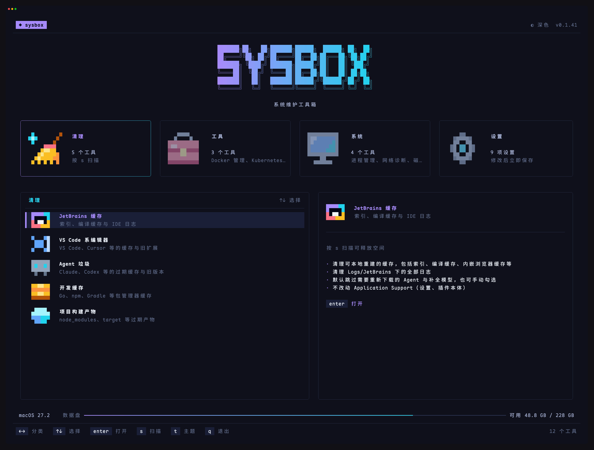 | 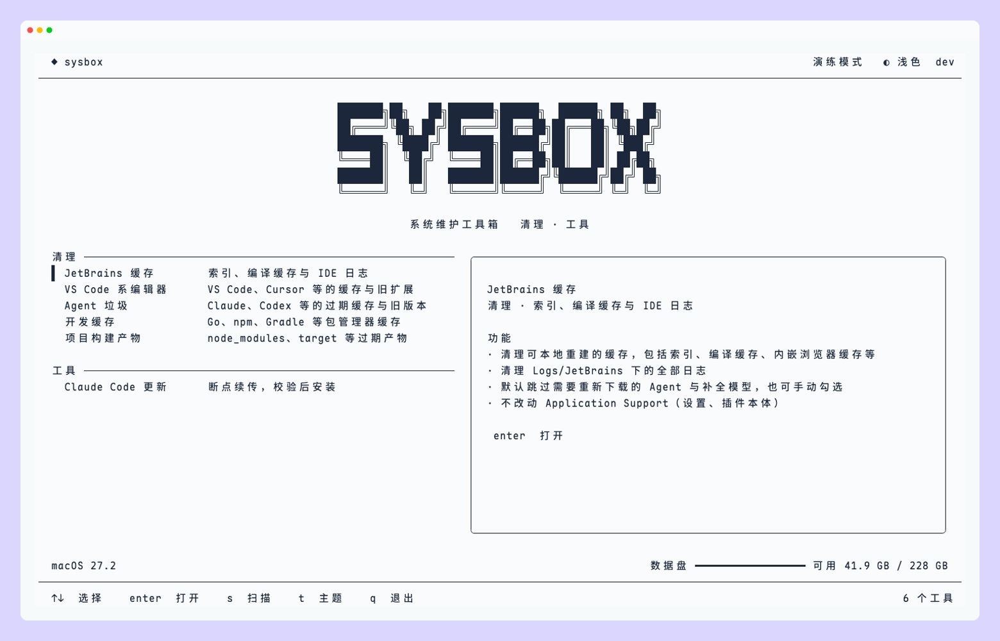 |
| 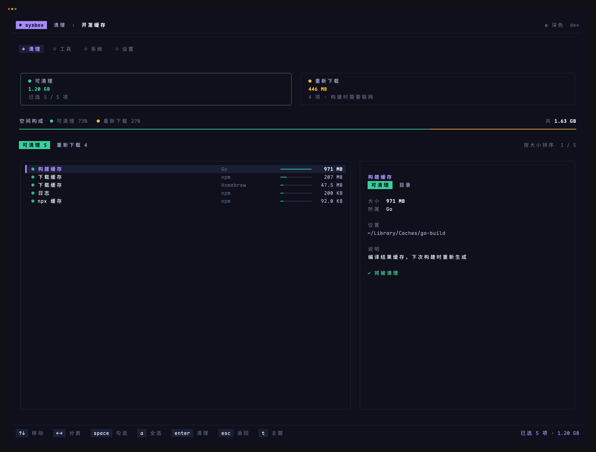 | 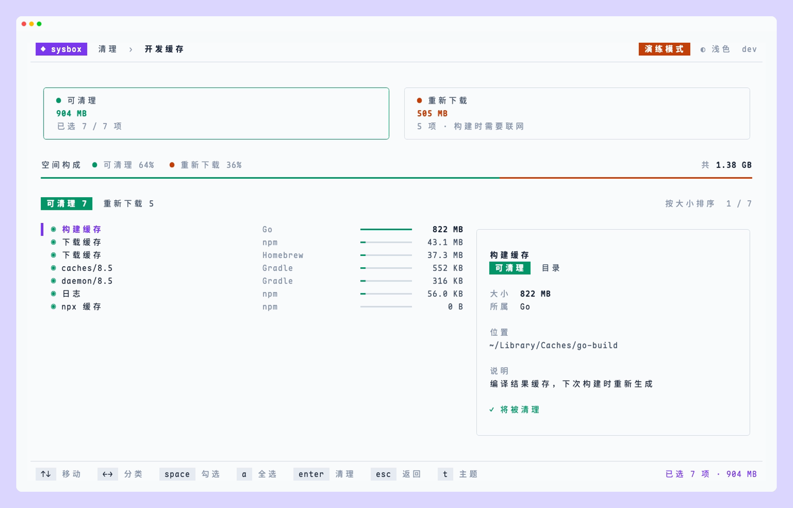 |
| 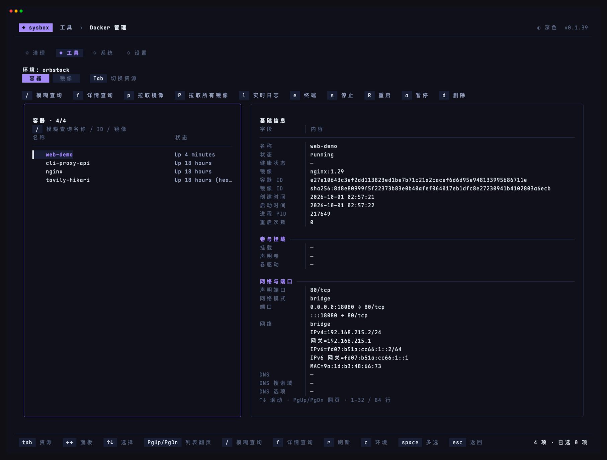 | 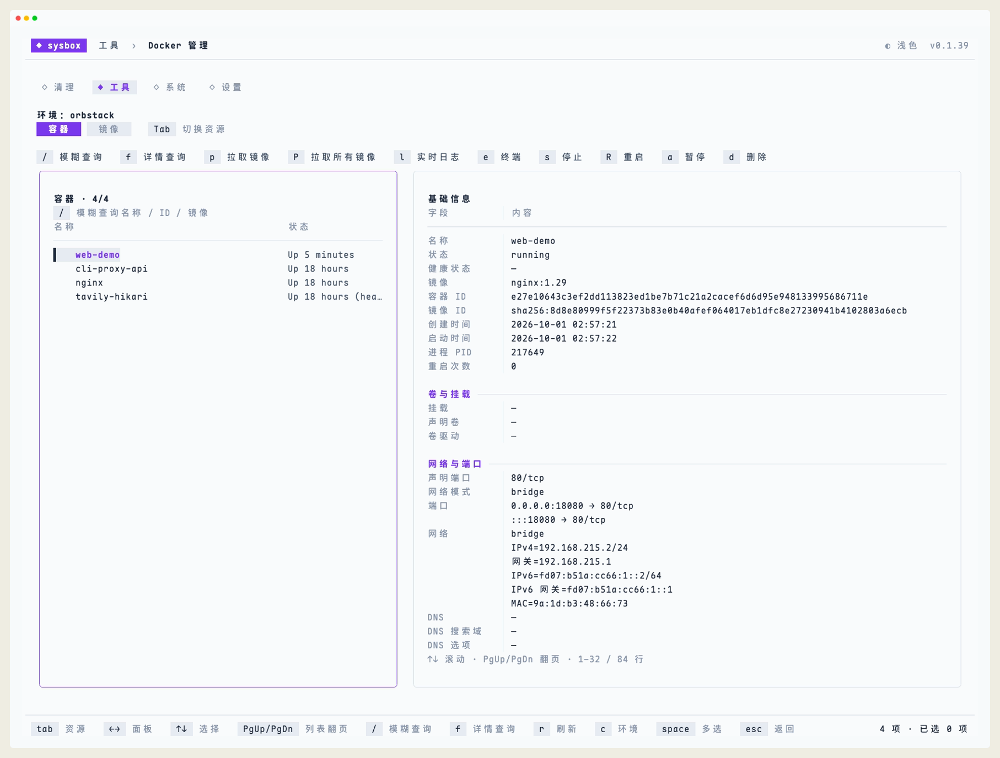 |
| 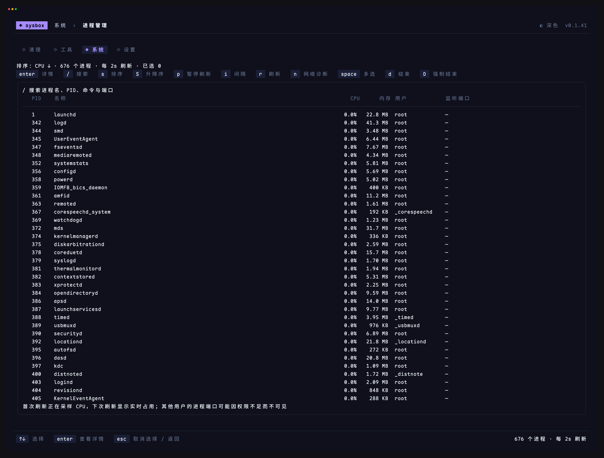 | 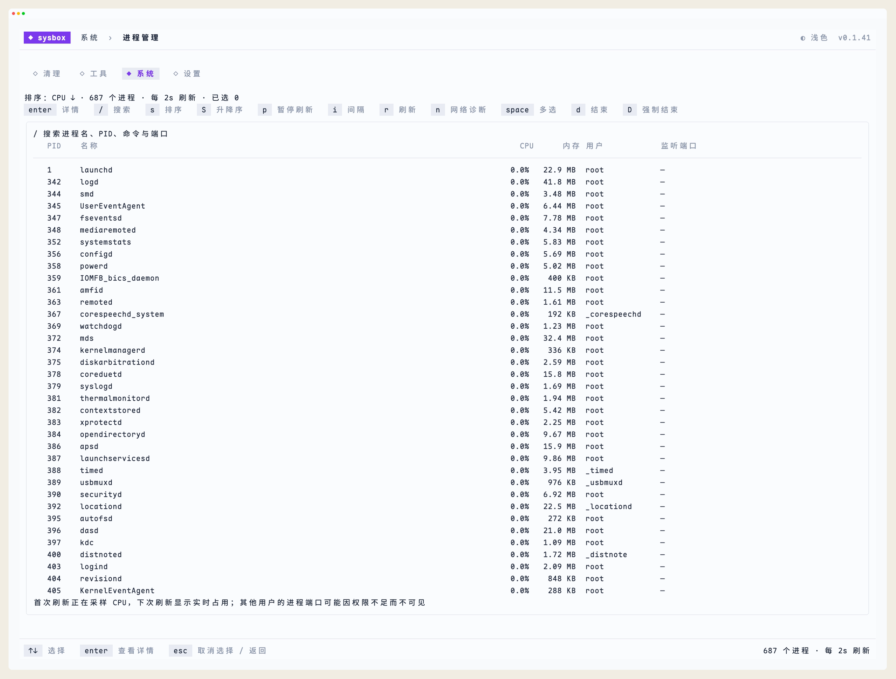 |
| 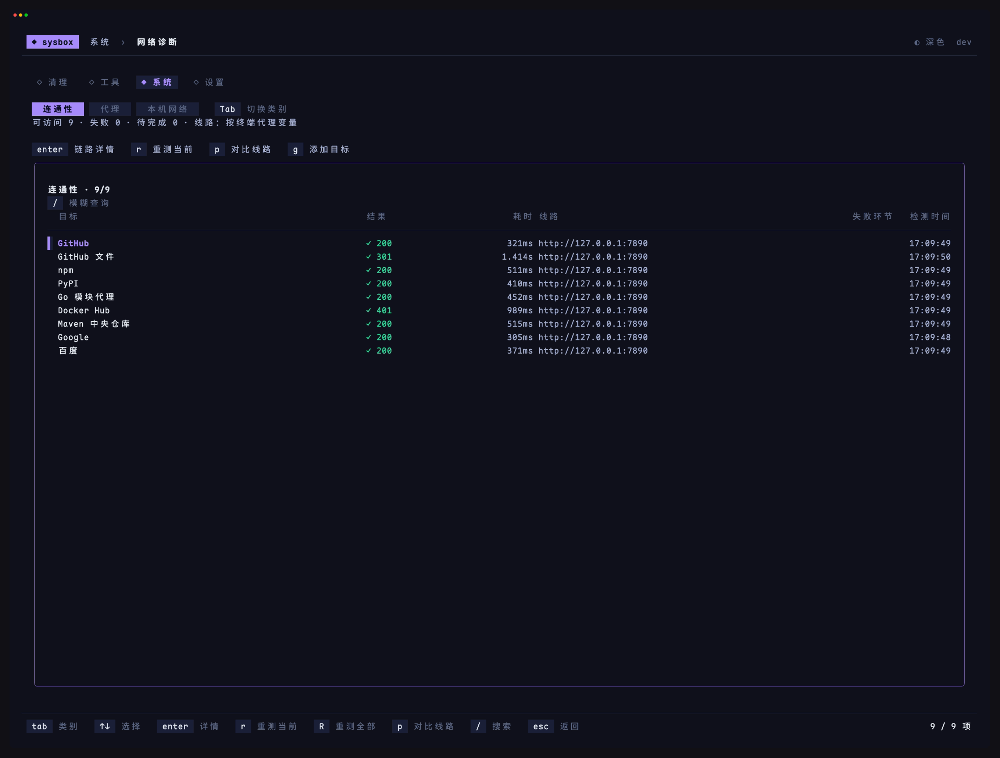 | 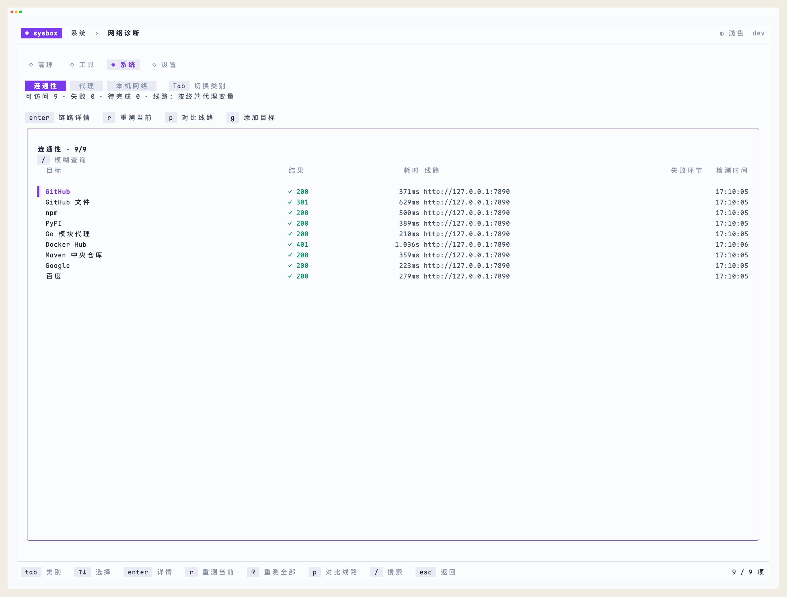 |
| 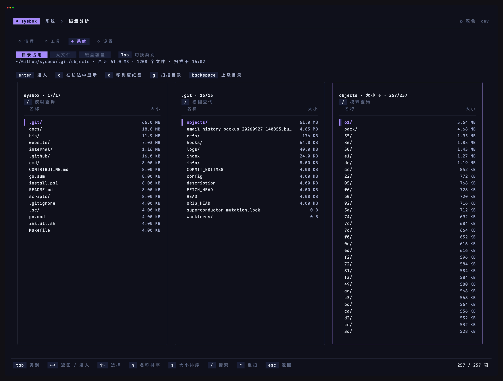 | 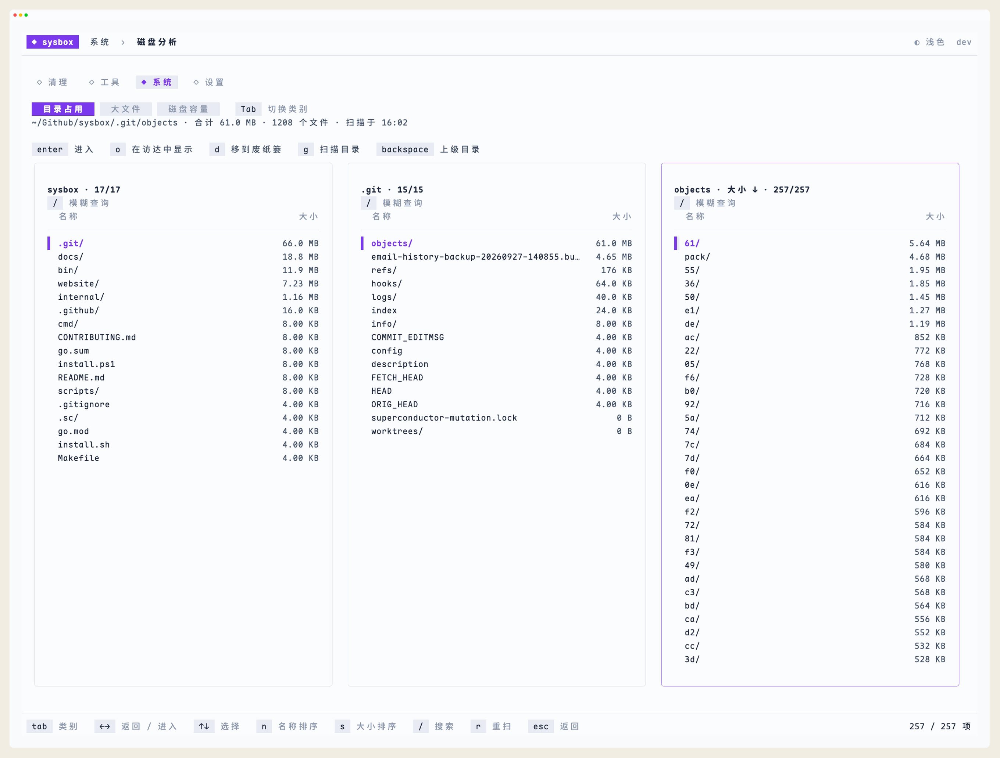 |
| 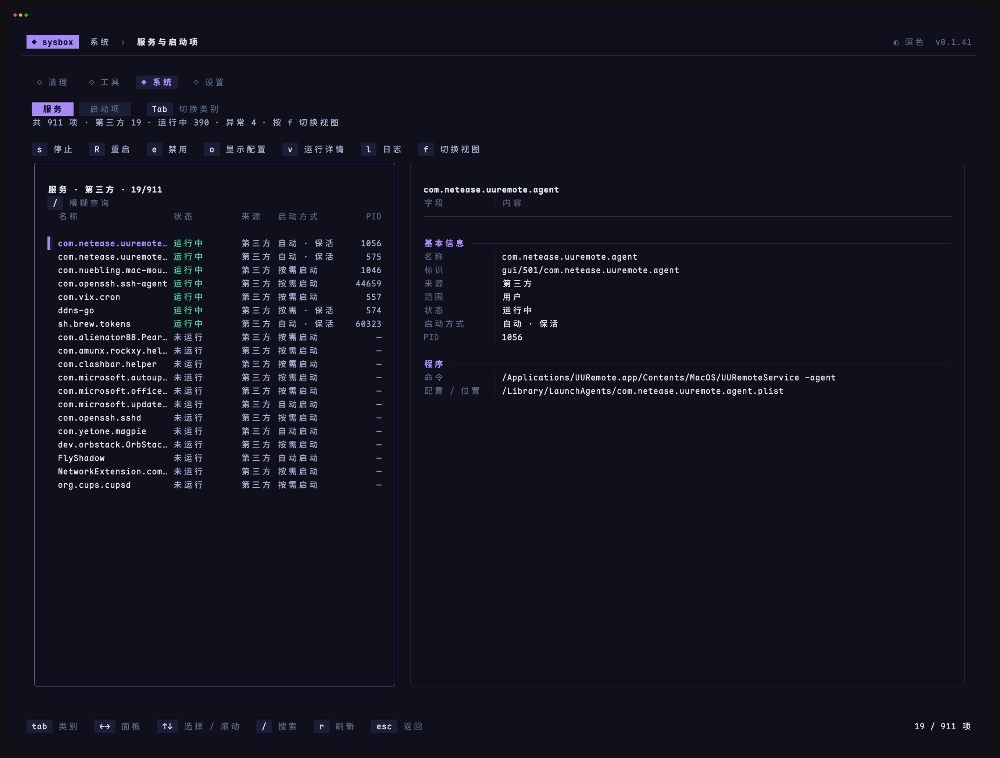 | 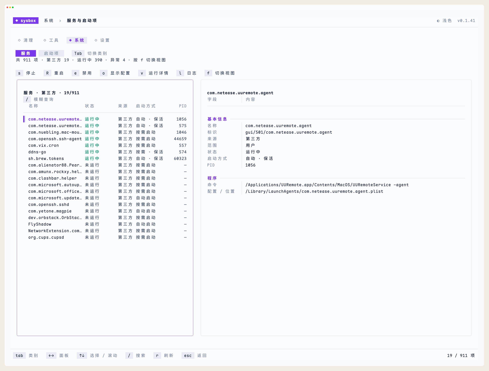 |

开发与贡献请参阅[开发指南](CONTRIBUTING.md)。
