# sysbox

跨平台的系统维护工具箱：把零散的清理和工具更新脚本收进一个终端界面，支持 macOS 与 Windows。

## 功能

| 分组 | 工具 | 作用 |
|---|---|---|
| 清理 | JetBrains 缓存 | 清理索引、编译缓存与 IDE 日志；默认跳过需要重新下载的 Agent 与补全模型（可手动勾选），不碰设置与插件目录 |
| 清理 | VS Code 系编辑器 | 清理 VS Code、Insiders、Cursor、Windsurf、Trae 的旧扩展、旧服务端、可重建缓存、日志和崩溃报告；设置、当前引用版本和未知目录默认不勾选，可手动纳入 |
| 清理 | Agent 垃圾 | 默认清理 Claude、Codex、OpenCode 等超过保留期的缓存；近期缓存、日志、旧版本和疑似备份可手动勾选 |
| 清理 | 开发缓存 | 清理 Go、npm、pnpm、Yarn、Bun、pip、uv、Gradle、Maven、Cargo、Homebrew 的缓存；构建依赖默认不勾选 |
| 清理 | 项目构建产物 | 查找长期未活动项目的 node_modules、target、build、.venv 等构建产物 |
| 工具 | Docker 管理 | 筛选容器与镜像，批量启停、查看日志、进入终端、拉取与删除镜像 |
| 工具 | Kubernetes 管理 | 切换集群和命名空间，管理 Deployment、ConfigMap、Pod、Node |
| 工具 | Claude Code 更新 | 断点续传下载指定版本，SHA-256 校验后调用官方安装 |
| 系统 | 进程管理 | 定时刷新进程与端口，按资源占用排序，查看父子进程、网络连接与环境变量 |
| 设置 | 配置项 | 在首页直接修改主题、列表图标、界面动画、更新检查、清理保留天数、项目扫描目录与 Claude 下载代理，修改后立即保存 |

清理操作执行前会确认；Docker 与 Kubernetes 的日常管理使用快捷键直接执行，删除资源和排空节点采用就地确认。加上 `--dry-run` 可以完整走一遍流程而不做任何修改。首页按 `s` 可以一次扫描全部清理工具，列出各自可释放的空间与合计。

## 安装

支持 macOS 与 Windows，x86_64 与 ARM 架构均可。

macOS：

```bash
curl -fsSL https://raw.githubusercontent.com/KevinXC5/sysbox/main/install.sh | bash
```

默认安装到 `~/.local/bin/sysbox`，可用 `SYSBOX_INSTALL_DIR` 指定目录，用 `SYSBOX_VERSION=v0.1.12` 安装指定版本。

Windows（PowerShell）：

```powershell
irm https://raw.githubusercontent.com/KevinXC5/sysbox/main/install.ps1 | iex
```

默认安装到 `%LOCALAPPDATA%\Programs\sysbox` 并加入用户 PATH，当前终端可直接运行 `sysbox`，同样支持 `SYSBOX_INSTALL_DIR` 与 `SYSBOX_VERSION` 环境变量。建议使用 Windows Terminal 运行。

## 升级

- 界面每次启动时检查一次新版本，有更新时顶栏会提示，首页按 `u` 查看更新内容并升级、重启
- 也可以在命令行执行 `sysbox update`，升级前会列出更新内容
- 在首页「设置」中关闭「启动时检查更新」，或在配置文件中设置 `"update": {"disable_check": true}`，可关闭自动检查

## 卸载

```bash
sysbox uninstall          # 删除程序，Windows 上同时从用户 PATH 移除安装目录，保留配置文件
sysbox uninstall --purge  # 同时删除配置目录
```

卸载前会列出要执行的操作并确认，加 `-y` 跳过确认，加 `--dry-run` 只查看不执行。

## 使用

```bash
sysbox                 # 打开界面
sysbox jetbrains       # 直接打开某个工具，工具名见 sysbox list
sysbox vscode          # 清理 VS Code、Cursor 等编辑器的旧版本、缓存与日志
sysbox devcache        # 清理包管理器与构建工具的缓存
sysbox docker          # 管理 Docker 容器与镜像
sysbox k8s             # 管理 Kubernetes 资源
sysbox processes       # 查看进程、端口与环境变量
sysbox projects        # 清理长期未活动项目的构建产物
sysbox --dry-run vscode # 演练 VS Code 清理，不删除文件
sysbox --dry-run       # 演练模式
sysbox --theme light   # 指定主题：auto、light、dark
sysbox list            # 列出全部工具
sysbox update          # 升级到最新版本
sysbox version         # 显示版本号
```

通用按键：`↑↓` 移动，`enter` 确认，`esc` 返回，`t` 切换主题，`ctrl+c` 退出。各页面的其余按键显示在底栏。

主题默认跟随终端背景色自动选择深色或浅色，按 `t` 在 自动 → 浅色 → 深色 之间切换，选择会被记住。

### 首页

- 顶部是「清理」「工具」「系统」「设置」四个分类方块，用 `←→` 切换；下方列出当前分类的条目，用 `↑↓` 选择，右侧显示详情。
- 按 `s` 一次扫描全部清理工具，方块和列表显示各自可释放的空间，底栏显示合计；从工具返回首页时会重新统计该工具
- 「设置」分类里的配置项按 `enter` 切换取值，扫描目录、代理地址等文字配置按 `enter` 编辑，修改后立即写入配置文件
- 打开工具时分类方块向上收成顶部的分类条，返回首页时再展开；动画约 0.2～0.3 秒，可在「设置」中关闭
- 图标用字符色块绘制，不依赖字体，需要终端支持真彩色；窗口达到约 50 行时显示大字 Logo

### 进程管理

从「系统」打开「进程管理」，或运行 `sysbox processes`。全宽表格显示进程、CPU、内存、用户和监听端口，默认按 CPU 降序排列，每 2 秒自动刷新。进入页面不选中任何进程，按方向键后才显示高亮，高亮保持在当前行。按 `enter` 打开接近主体全屏的详情弹窗，同时以三列查看基本信息、端口与连接、环境变量；弹窗绑定进程身份，刷新时保持详情滚动位置。

- `/` 搜索名称、PID、完整命令、端口与地址，多个查询词都需匹配。文本支持模糊匹配，纯数字精确匹配 PID 或监听/绑定端口；`port:5353` 只查监听/绑定端口，`pid:5353` 只查 PID，数字不匹配命令行或活动连接；弹窗中 `f` 查询详情。`enter` 完成查询，`esc` 清空查询。
- `s` 切换 CPU、内存、名称、PID、监听端口排序，`S` 切换升降序。端口排序取最小监听或绑定端口，无端口的进程始终排最后。
- `p` 暂停或恢复自动刷新，`i` 在 1、2、5 秒之间切换间隔，`r` 手动刷新并重新读取当前进程环境。采集不会重叠，CPU 按两次采样的累计时间差计算，100% 表示一个逻辑核心，首次采样需要等待基线。
- 表格中 `↑↓` 选择进程，`enter` 打开详情，`esc` 取消选择，再按一次返回首页。弹窗中基本信息、端口与连接、环境变量同时显示，默认高亮基本信息列；`←→` 切换当前列，`↑↓` 只滚动当前列，各列保留独立的滚动位置，`esc` 关闭弹窗。
- 基本信息包含完整命令、路径、用户、启动时间和父子进程。端口列表显示 TCP 监听与 UDP 绑定，右侧包含活动连接；部分进程的信息可能受权限限制。
- 环境变量按需读取，代理变量优先显示，并对比当前进程和父进程的代理变量。凭据与代理认证默认遮蔽，详情弹窗按 `v` 显示或隐藏原始值。环境读取失败会明确提示原因；父子差异用于排查当前环境，不代表启动时的完整继承历史。
- `space` 多选，`d` 请求正常结束，`D` 强制结束；在弹窗中按 `y` 确认或 `esc` 取消。操作前重新核对进程身份。macOS 正常结束发送 SIGTERM；Windows 正常结束请求关闭应用窗口，无窗口进程需要程序自己的退出方式或强制结束。

运行 `sysbox --dry-run processes` 可演练结束操作，进程、端口和环境仍正常读取。进程管理只查看现有环境，代理变量应在启动方配置并传给子进程。

### Docker 管理

从「工具」打开「Docker 管理」，或运行 `sysbox docker`。需要安装 Docker CLI 并启动 Docker 引擎，支持 Docker Desktop、OrbStack 与已有的远程 Docker context。

界面左侧五分之二是资源列表，右侧五分之三是选中资源的信息表。资源筛选位于左侧列表上方，资源标签以底色标识当前选中项，旁边提示 `Tab` 切换资源。`←→` 切换左右面板，高亮边框标识当前面板；左侧 `↑↓` 选择资源，右侧 `↑↓` 滚动内容。选择资源时信息自动更新，表格上方显示当前可用的操作快捷键。信息表按卷与挂载、网络与端口、运行配置、资源与权限、健康检查、日志与存储分组，显示卷名、源路径、目标路径、读写方式、IP、网关、DNS、环境变量、CPU 和内存限制等。镜像显示声明卷、入口程序、启动参数、健康检查、镜像层，以及关联容器的实际挂载。敏感环境变量值隐藏。界面只显示操作结果和资源信息。

- `Tab` 切换容器和镜像（`Shift+Tab` 反向），`/` 实时模糊查询，`r` 刷新，`c` 就地切换 Docker 环境，仅影响当前工具。
- 容器：`l` 实时日志，`e` 直接进入默认 `/bin/sh`，`E` 输入其他 Shell，`s` 启动、停止或恢复（按状态变化），`R` 重启，`a` 暂停，`d` 删除。
- 镜像：`p` 输入镜像名称拉取（默认填入当前镜像），`P` 拉取所有本地有标签的镜像，`s` 创建容器，`g` 添加标签，`d` 删除。镜像名称、容器名称和标签直接在右侧输入，按 `enter` 执行。创建容器使用镜像默认命令、后台运行，不自动配置端口和目录挂载。
- `space` 多选容器或镜像，随后使用对应快捷键批量操作，提示只显示所选资源共有的操作。日志和终端针对当前光标所在资源；筛选隐藏的已选项仍参与批量操作，底栏显示已选数量。
- 实时日志显示在右侧，打开后持续接收并自动滚到底部。按 `space` 暂停或恢复自动滚动；暂停时继续接收新日志并显示数量，恢复后回到最新内容。右侧使用 `↑↓` 逐行滚动、`PgUp/PgDn` 翻页、`ctrl+u/ctrl+d` 逐段滚动，手动滚动会自动暂停跟随。`b` 或 `esc` 返回基础信息，选择其他资源后自动关闭旧日志连接。日志保留最近 2000 行且最多 2 MiB，暂停时保持当前阅读快照。
- 删除按 `d` 后在右侧列出目标，按 `y` 确认，`esc` 取消。容器需要先停止，删除保留卷和镜像；镜像只删除所选标签，无标签镜像按 ID 删除，不强制删除使用中的镜像。

资源查询支持名称、ID、镜像、状态、命名空间等字段，不区分大小写，支持跳字匹配及多个空格分隔的关键词。例如 `ngnx run` 可查找运行中的 nginx 容器。输入时 `↑↓` 选择，`enter` 保留查询并恢复快捷键，`esc` 一次清空。右侧按 `f` 模糊查询字段和内容，例如查询“挂载”可直接定位卷与挂载信息，日志同样支持内容查询。环境和命名空间选择列表可直接输入名称模糊查询。

运行 `sysbox --dry-run docker` 可演练操作；列表、基础信息和日志正常读取，修改仅显示操作摘要，不会执行。

### Kubernetes 管理

从「工具」打开「Kubernetes 管理」，或运行 `sysbox k8s`。需要安装 `kubectl`，通过 kubeconfig 配置集群，并具有对应资源的访问权限。

左侧列出资源，右侧自动显示基础信息表，包括命名空间、创建时间、副本数、容器就绪状态、镜像、节点地址和容量等。`/` 支持多个关键词和跳字匹配，`f` 查询右侧信息或日志；集群、命名空间和 Pod 容器选择时可直接输入名称过滤。表格上方按当前资源显示快捷键，日常操作直接执行，参数就地输入。`←→` 切换左右面板，边框高亮当前面板；左侧 `↑↓` 选择资源，右侧 `↑↓` 滚动信息。

- `Tab` 切换 Deployment、ConfigMap、Pod、Node（`Shift+Tab` 反向），`/` 实时模糊查询，`r` 刷新。
- `c` 就地选择集群，`n` 选择命名空间；没有列出命名空间的权限时，按 `N` 手动输入。选择 `*` 可查看全部命名空间，节点始终按集群范围查询。
- 工具不改写全局 kubeconfig。操作始终绑定所选集群和资源自身的命名空间。
- Deployment：`l` 实时日志，`s` 输入副本数并扩缩容，`R` 滚动重启，`u` 发布状态，`e` 编辑 YAML。副本数可设为 `0`。
- ConfigMap：`e` 编辑 YAML，遵循 `KUBE_EDITOR` / `EDITOR` 设置，保存后提交到集群。
- Pod：`l` 全部容器实时日志，`e` 进入 `/bin/sh`；多个容器时直接在右侧选择。`d` 删除，控制器管理的 Pod 通常会自动重建。
- Node：`s` 禁止或恢复调度，`D` 排空。排空遵守 PDB、忽略 DaemonSet，不强制驱逐有本地数据或非托管的 Pod；排空失败后节点可能仍禁止调度，可按 `s` 恢复。
- 实时日志默认自动滚动，按 `space` 暂停或恢复；暂停时继续接收。切换资源、返回详情或离开工具时关闭日志连接。
- `v` 查看 YAML，`i` 查看详细状态；内容显示在右侧，`PgUp/PgDn` 翻页，`b` 返回基础信息。
- 删除和节点排空在右侧就地确认，按 `y` 执行。`sysbox --dry-run k8s` 仅显示操作摘要，交互编辑和容器终端也不会执行。

### VS Code 系编辑器

从首页选择「VS Code 系编辑器」，或运行 `sysbox vscode`。支持 macOS 与 Windows 上默认目录中的 VS Code、VS Code Insiders、Cursor、Windsurf、Trae、Trae CN，以及当前用户目录中对应的远程服务端。

- 默认可清理的是可重建缓存、扩展安装包缓存、日志、崩溃报告，以及已确认落后且未被引用的旧扩展。
- 设置、快捷键、工作区状态、未保存文件备份、当前引用版本、同平台最新版本和未知目录默认不勾选。手动勾选后按不可恢复处理，删除前会再核对一次。
- 旧服务端仅在版本信息足够时列出，默认不勾选。手动清理前请停止相关服务端，再次连接相应版本时需要重新下载。读不到版本的安装不能勾选。
- 扩展索引缺失或损坏时整组不可选。符号链接不跟随目标。应用数据、扩展目录和服务端根目录本身不会删除。不扫描自定义数据目录或便携安装目录。

清理前需要退出所选条目涉及的编辑器，未勾选的编辑器可以继续运行。先运行 `sysbox --dry-run vscode` 可查看扫描结果并演练清理流程。

### 开发缓存

从首页选择「开发缓存」，或运行 `sysbox devcache`。

- 默认勾选只影响下次安装速度的缓存：Go 构建缓存，npm、Yarn、Bun、pip、uv、Homebrew 的下载缓存，Gradle 构建缓存，Cargo 解压的源码。
- 构建依赖默认不勾选，删除后需要联网重新下载：Go 模块缓存、pnpm store、Gradle 依赖缓存、Maven 本地仓库、Cargo 压缩包缓存。Maven 仓库里 `mvn install` 安装的构件删除后无法重新下载。
- Gradle 的 `caches/<版本>`、`daemon/<版本>` 与 `wrapper/dists` 只保留最高版本。
- 缓存位置优先询问工具本身（如 `go env`），其次读取 `GOMODCACHE`、`GRADLE_USER_HOME`、`CARGO_HOME` 等环境变量，最后使用默认位置。Go 与 uv 调用官方清理命令，其余直接删除目录；符号链接不能勾选。
- pnpm store 被项目的 node_modules 以硬链接引用，项目仍在时实际释放会少于显示大小。

### 项目构建产物

从首页选择「项目构建产物」，或运行 `sysbox projects`。

- 在项目目录下查找 node_modules、.next、target、build、dist、.gradle、.dart_tool、.build、obj、bin、.venv 等构建产物。产物旁必须有对应的项目文件（如 package.json、Cargo.toml、pom.xml、build.gradle、*.csproj）才会列出。
- build、target、bin、obj 这类常见目录名还要有构建工具留下的特征才算产物，如 Gradle 的 classes、libs、tmp，Maven 的 classes、maven-status、jar 包，Cargo 的 CACHEDIR.TAG。前端的 build、dist 要求有网页资源，并由 git 确认已被忽略且没有受控文件；没装 git 或不在仓库里的不列出。
- 项目的活跃时间取 `.git` 状态文件与浅层源码的最新修改时间。超过保留期未活动的项目默认勾选，近期项目可手动勾选。Python 虚拟环境默认不勾选。
- 未配置 `projects.roots` 时扫描整个家目录。不跟随符号链接，不进入 Library、AppData、图片与影音目录、Scoop 与 Conda 安装目录、Go 模块缓存和隐藏目录。

### Agent 垃圾

从首页选择「Agent 垃圾」，或运行 `sysbox agent`。

- 默认勾选超过保留期的缓存。日志、保留期内仍有修改的缓存默认不勾选，可手动纳入。
- 能确认的旧版本默认勾选；当前版本和最高版本不列入清理。当前版本通过版本链接确认；Windows 上 Claude 的 claude.exe 是从版本目录复制出来的独立文件，只保留最高版本（可能是已下载、尚未安装的更新）。
- 无法确认当前版本时（如 Windows 上的 Codex、Grok），候选版本进入待核查，默认不勾选，可手动删除。单文件安装的疑似备份同样如此。
- 目录内指向外部的符号链接、检查失败的条目不能勾选。删除前复核路径、inode 和当前版本，目标有变化会跳过。会话、凭据、插件和配置不在扫描范围内。

## 配置

首页「设置」分类可以直接修改下列配置，修改后立即写入配置文件。配置文件位于 `~/.config/sysbox/config.json`（遵循 `XDG_CONFIG_HOME`），Windows 上位于 `%APPDATA%\sysbox\config.json`。所有字段都可省略：

```json
{
  "theme": "auto",
  "icons": "show",
  "animation": "on",
  "agent": { "keep_days": 30 },
  "projects": { "roots": ["~/Github"], "keep_days": 30 },
  "claude": { "proxy": "http://127.0.0.1:7890", "direct": false },
  "update": { "disable_check": false }
}
```

| 字段 | 说明 |
|---|---|
| `theme` | 主题：`auto`、`light`、`dark`，默认 `auto` |
| `icons` | 首页列表的像素图标：`show` 显示，`none` 关闭，默认 `show` |
| `animation` | 进入和退出工具页的过渡动画：`on` 开启，`off` 关闭，默认 `on` |
| `update.disable_check` | 关闭启动时的新版本检查 |
| `agent.keep_days` | 缓存与日志的保留天数，默认 30 |
| `projects.roots` | 扫描构建产物的项目目录，支持 `~` 开头；省略时扫描整个家目录 |
| `projects.keep_days` | 项目多少天未活动算过期，默认 30 |
| `claude.proxy` | 下载 Claude Code 使用的代理；代理不可用时自动直连。也可用环境变量 `PROXY_URL` 覆盖 |
| `claude.direct` | 始终直连，等同于环境变量 `CLAUDE_NO_PROXY=1` |

## 截图

| | |
|---|---|
|  | 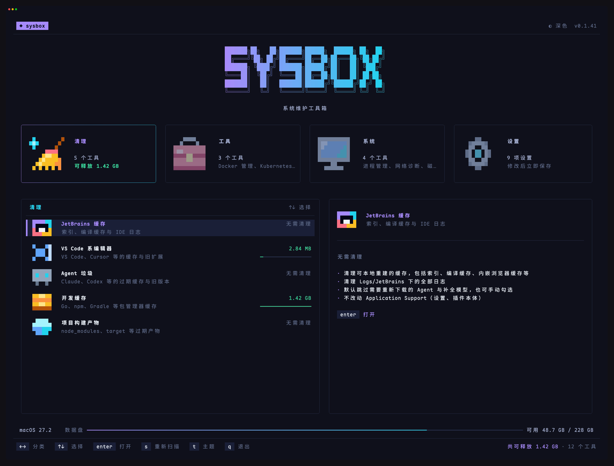 |
| 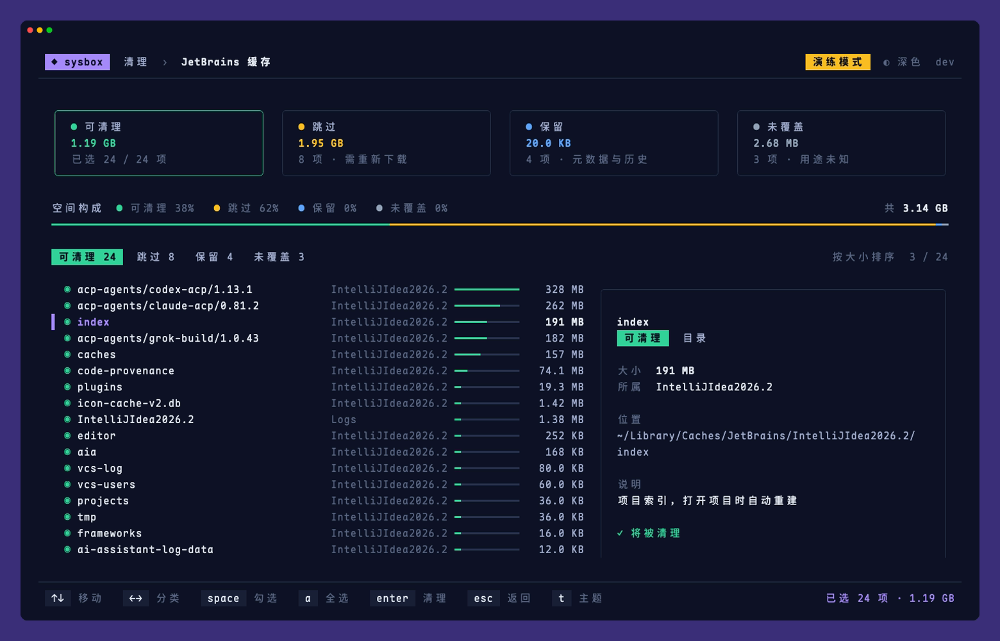 | 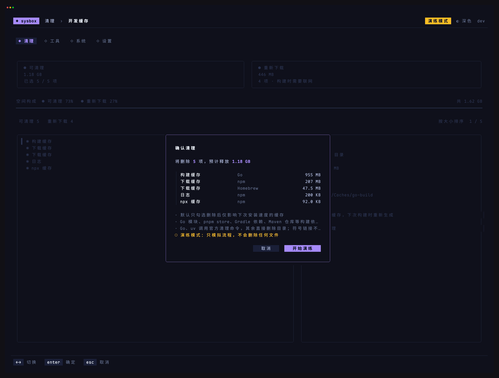 |
| 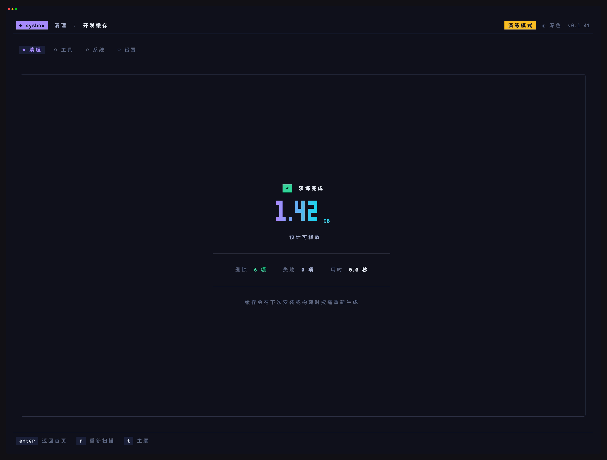 | 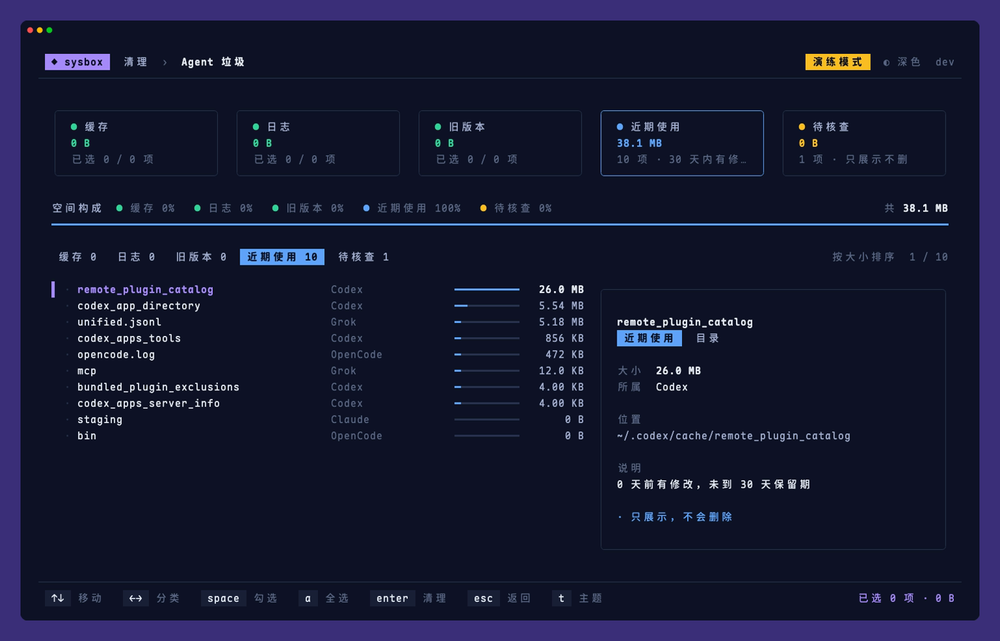 |
| 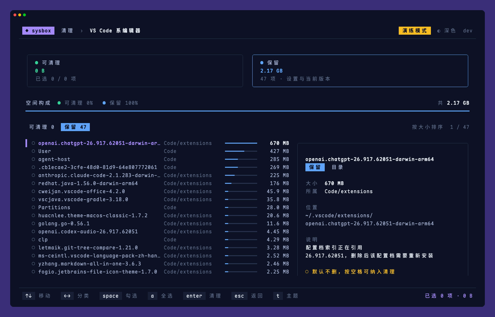 |  |
| 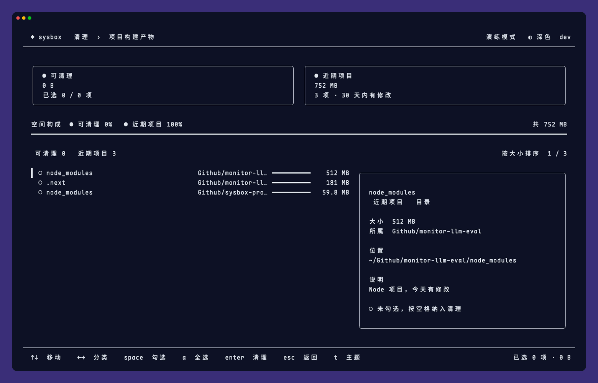 | 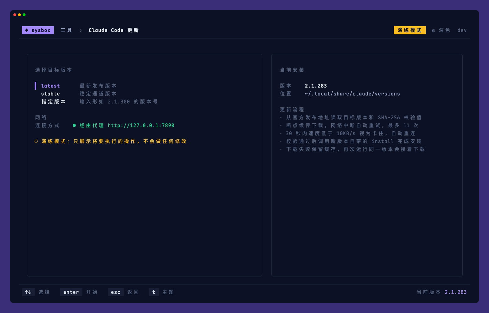 |
| 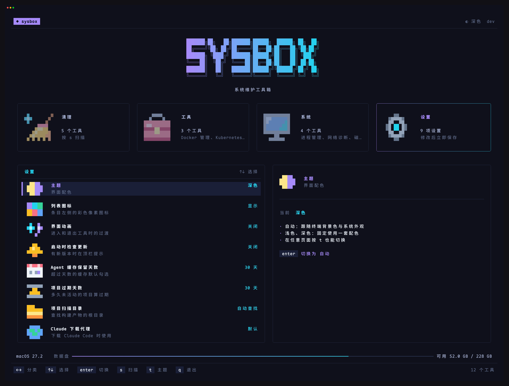 | |

浅色主题：

| | |
|---|---|
| 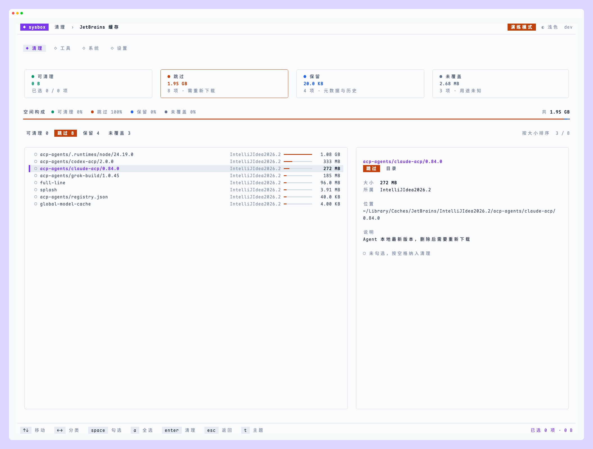 | 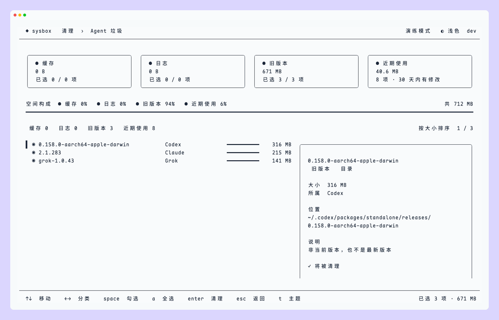 |

开发与贡献请参阅[开发指南](CONTRIBUTING.md)。
