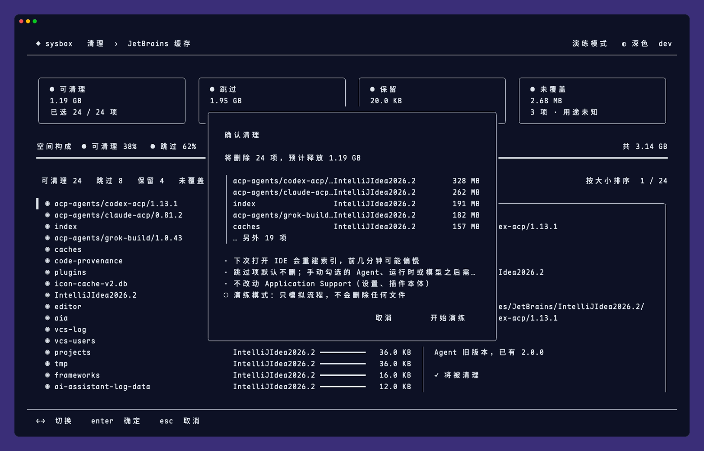
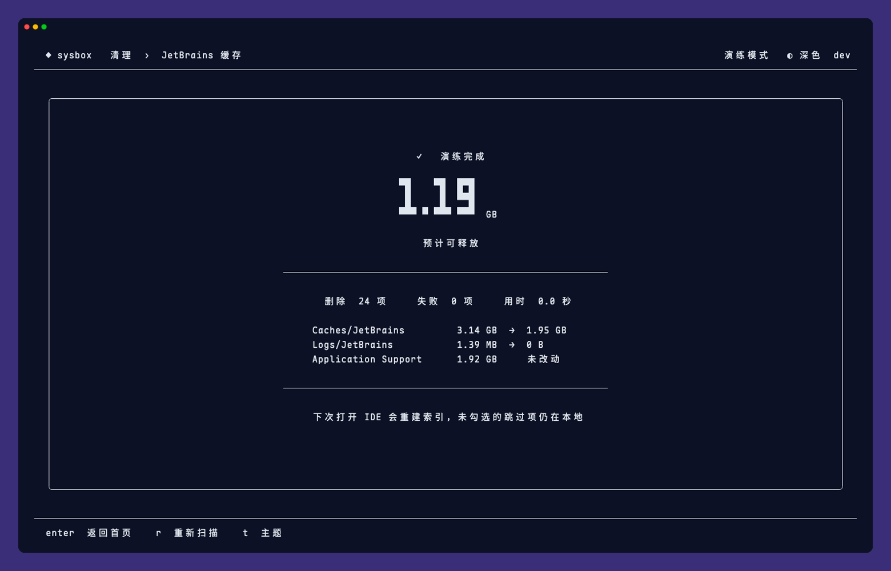

# sysbox

跨平台的系统维护工具箱：把零散的清理和工具更新脚本收进一个终端界面，支持 macOS 与 Windows。

## 功能

| 分组 | 工具 | 作用 |
|---|---|---|
| 清理 | JetBrains 缓存 | 清理索引、编译缓存与 IDE 日志；默认跳过需要重新下载的 Agent 与补全模型（可手动勾选），不碰设置与插件目录 |
| 清理 | VS Code 系编辑器 | 清理 VS Code、Insiders、Cursor、Windsurf、Trae 的旧扩展、旧服务端、可重建缓存、日志和崩溃报告；设置、当前引用版本和未知目录默认不勾选，可手动纳入 |
| 清理 | Agent 垃圾 | 默认清理 Claude、Codex、OpenCode 等超过保留期的缓存；近期缓存、日志、旧版本和疑似备份可手动勾选 |
| 清理 | 开发缓存 | 清理 Go、npm、pnpm、Yarn、Bun、pip、uv、Gradle、Maven、Cargo、Homebrew 的缓存；构建依赖默认不勾选 |
| 清理 | 项目构建产物 | 查找长期未活动项目的 node_modules、target、build、.venv 等构建产物 |
| 工具 | Claude Code 更新 | 断点续传下载指定版本，SHA-256 校验后调用官方安装 |

所有会修改系统的操作都有确认弹窗；加上 `--dry-run` 可以完整走一遍流程而不做任何修改。首页按 `s` 可以一次扫描全部清理工具，列出各自可释放的空间与合计。

## 安装

支持 macOS 与 Windows，x86_64 与 ARM 架构均可。

macOS：

```bash
curl -fsSL https://raw.githubusercontent.com/KevinXC5/sysbox/main/install.sh | bash
```

默认安装到 `~/.local/bin/sysbox`，可用 `SYSBOX_INSTALL_DIR` 指定目录，用 `SYSBOX_VERSION=v0.1.12` 安装指定版本。

Windows（PowerShell）：

```powershell
irm https://raw.githubusercontent.com/KevinXC5/sysbox/main/install.ps1 | iex
```

默认安装到 `%LOCALAPPDATA%\Programs\sysbox` 并加入用户 PATH，当前终端可直接运行 `sysbox`，同样支持 `SYSBOX_INSTALL_DIR` 与 `SYSBOX_VERSION` 环境变量。建议使用 Windows Terminal 运行。

## 升级

- 界面每次启动时检查一次新版本，有更新时顶栏会提示，首页按 `u` 查看更新内容并升级、重启
- 也可以在命令行执行 `sysbox update`，升级前会列出更新内容
- 在配置文件中设置 `"update": {"disable_check": true}` 可关闭自动检查

## 卸载

```bash
sysbox uninstall          # 删除程序，Windows 上同时从用户 PATH 移除安装目录，保留配置文件
sysbox uninstall --purge  # 同时删除配置目录
```

卸载前会列出要执行的操作并确认，加 `-y` 跳过确认，加 `--dry-run` 只查看不执行。

## 使用

```bash
sysbox                 # 打开界面
sysbox jetbrains       # 直接打开某个工具，工具名见 sysbox list
sysbox vscode          # 清理 VS Code、Cursor 等编辑器的旧版本、缓存与日志
sysbox devcache        # 清理包管理器与构建工具的缓存
sysbox projects        # 清理长期未活动项目的构建产物
sysbox --dry-run vscode # 演练 VS Code 清理，不删除文件
sysbox --dry-run       # 演练模式
sysbox --theme light   # 指定主题：auto、light、dark
sysbox list            # 列出全部工具
sysbox update          # 升级到最新版本
sysbox version         # 显示版本号
```

通用按键：`↑↓` 移动，`enter` 确认，`esc` 返回，`t` 切换主题，`ctrl+c` 退出。首页按 `s` 扫描可释放空间，从工具返回首页时会重新统计该工具。各页面的其余按键显示在底栏。

主题默认跟随终端背景色自动选择深色或浅色，按 `t` 在 自动 → 浅色 → 深色 之间切换，选择会被记住。

### VS Code 系编辑器

从首页选择「VS Code 系编辑器」，或运行 `sysbox vscode`。支持 macOS 与 Windows 上默认目录中的 VS Code、VS Code Insiders、Cursor、Windsurf、Trae、Trae CN，以及当前用户目录中对应的远程服务端。

- 默认可清理的是可重建缓存、扩展安装包缓存、日志、崩溃报告，以及已确认落后且未被引用的旧扩展。
- 设置、快捷键、工作区状态、未保存文件备份、当前引用版本、同平台最新版本和未知目录默认不勾选。手动勾选后按不可恢复处理，删除前会再核对一次。
- 旧服务端仅在版本信息足够时列出，默认不勾选。手动清理前请停止相关服务端，再次连接相应版本时需要重新下载。读不到版本的安装不能勾选。
- 扩展索引缺失或损坏时整组不可选。符号链接不跟随目标。应用数据、扩展目录和服务端根目录本身不会删除。不扫描自定义数据目录或便携安装目录。

清理前需要退出所选条目涉及的编辑器，未勾选的编辑器可以继续运行。先运行 `sysbox --dry-run vscode` 可查看扫描结果并演练清理流程。

### 开发缓存

从首页选择「开发缓存」，或运行 `sysbox devcache`。

- 默认勾选只影响下次安装速度的缓存：Go 构建缓存，npm、Yarn、Bun、pip、uv、Homebrew 的下载缓存，Gradle 构建缓存，Cargo 解压的源码。
- 构建依赖默认不勾选，删除后需要联网重新下载：Go 模块缓存、pnpm store、Gradle 依赖缓存、Maven 本地仓库、Cargo 压缩包缓存。Maven 仓库里 `mvn install` 安装的构件删除后无法重新下载。
- Gradle 的 `caches/<版本>`、`daemon/<版本>` 与 `wrapper/dists` 只保留最高版本。
- 缓存位置优先询问工具本身（如 `go env`），其次读取 `GOMODCACHE`、`GRADLE_USER_HOME`、`CARGO_HOME` 等环境变量，最后使用默认位置。Go 与 uv 调用官方清理命令，其余直接删除目录；符号链接不能勾选。
- pnpm store 被项目的 node_modules 以硬链接引用，项目仍在时实际释放会少于显示大小。

### 项目构建产物

从首页选择「项目构建产物」，或运行 `sysbox projects`。

- 在项目目录下查找 node_modules、.next、target、build、.gradle、.dart_tool、.build、obj、bin、.venv 等构建产物。产物旁必须有对应的项目文件（如 package.json、Cargo.toml、pom.xml、build.gradle、*.csproj）才会列出。
- 项目的活跃时间取 `.git` 状态文件与浅层源码的最新修改时间。超过保留期未活动的项目默认勾选，近期项目可手动勾选。Python 虚拟环境默认不勾选。
- 未配置 `projects.roots` 时，自动扫描家目录下的 Github、Projects、Developer、Code、src、workspace、repos、IdeaProjects 等常见目录。不跟随符号链接，不进入 Library、AppData 与隐藏目录。

### Agent 垃圾

从首页选择「Agent 垃圾」，或运行 `sysbox agent`。

- 默认勾选超过保留期的缓存。日志、保留期内仍有修改的缓存默认不勾选，可手动纳入。
- 能确认的旧版本默认勾选；当前版本和最高版本不列入清理。当前版本通过版本链接确认；Windows 上 Claude 的 claude.exe 是从版本目录复制出来的独立文件，只保留最高版本（可能是已下载、尚未安装的更新）。
- 无法确认当前版本时（如 Windows 上的 Codex、Grok），候选版本进入待核查，默认不勾选，可手动删除。单文件安装的疑似备份同样如此。
- 目录内指向外部的符号链接、检查失败的条目不能勾选。删除前复核路径、inode 和当前版本，目标有变化会跳过。会话、凭据、插件和配置不在扫描范围内。

## 配置

配置文件位于 `~/.config/sysbox/config.json`（遵循 `XDG_CONFIG_HOME`），Windows 上位于 `%APPDATA%\sysbox\config.json`。所有字段都可省略：

```json
{
  "theme": "auto",
  "agent": { "keep_days": 30 },
  "projects": { "roots": ["~/Github"], "keep_days": 30 },
  "claude": { "proxy": "http://127.0.0.1:7890", "direct": false },
  "update": { "disable_check": false }
}
```

| 字段 | 说明 |
|---|---|
| `agent.keep_days` | 缓存与日志的保留天数，默认 30 |
| `projects.roots` | 扫描构建产物的项目目录，支持 `~` 开头；省略时自动查找常见目录 |
| `projects.keep_days` | 项目多少天未活动算过期，默认 30 |
| `claude.proxy` | 下载 Claude Code 使用的代理；代理不可用时自动直连。也可用环境变量 `PROXY_URL` 覆盖 |
| `claude.direct` | 始终直连，等同于环境变量 `CLAUDE_NO_PROXY=1` |

## 截图

| | |
|---|---|
|  |  |
|  |  |
|  |  |
|  |  |
|  |  |

浅色主题：

| | |
|---|---|
|  |  |

开发与贡献请参阅[开发指南](CONTRIBUTING.md)。
