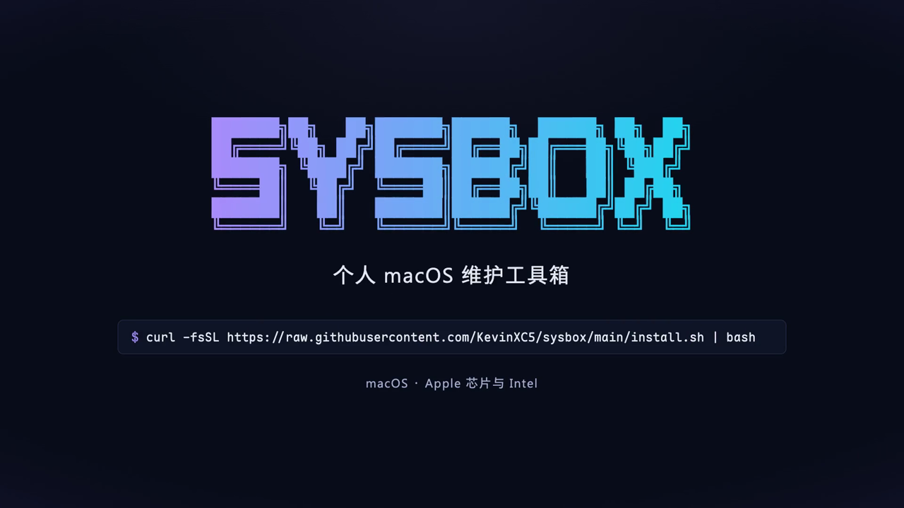
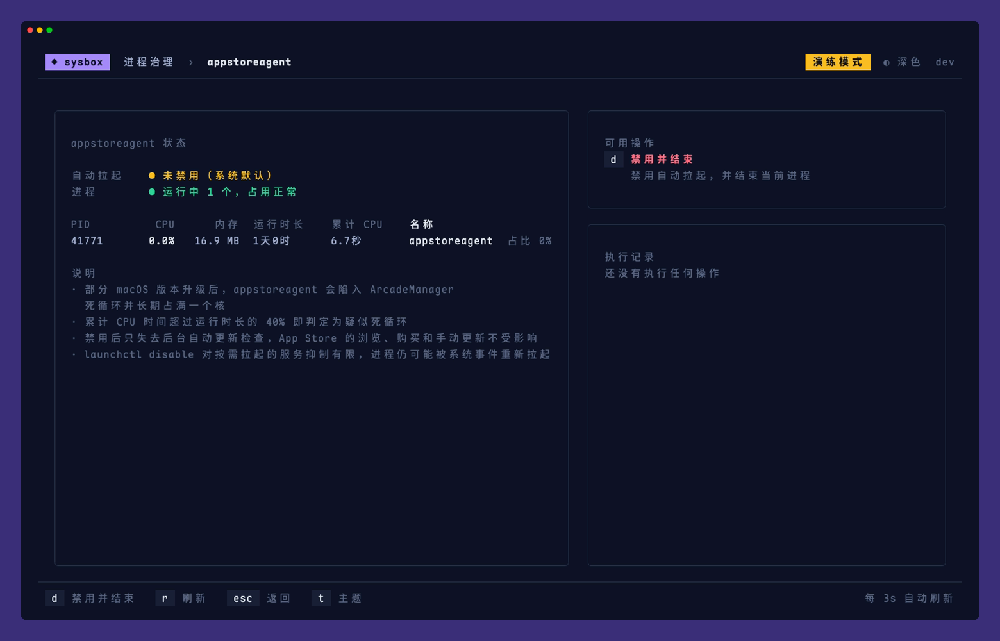
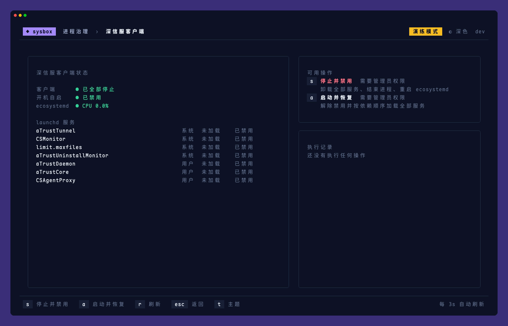
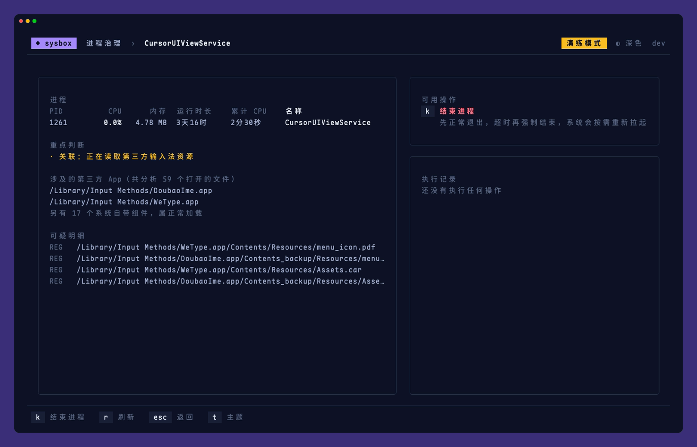
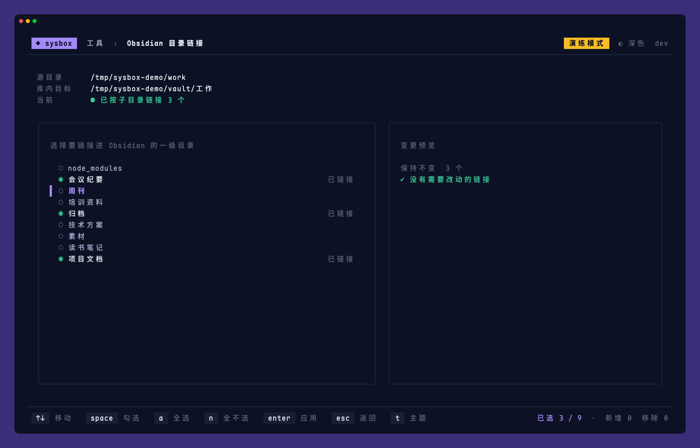

# sysbox

个人 macOS 维护工具箱：把零散的清理、进程治理和工具更新脚本收进一个终端界面。

[](docs/promo/sysbox-promo.mp4)

## 功能

| 分组 | 工具 | 作用 |
|---|---|---|
| 清理 | JetBrains 缓存 | 清理索引、编译缓存与 IDE 日志；跳过需要重新下载的 Agent 与补全模型，不碰 Application Support |
| 清理 | Agent 垃圾 | 清理 Claude、Codex、OpenCode 等超过保留期的缓存和日志，以及可以确认的旧版本 |
| 进程治理 | appstoreagent | 识别 ArcadeManager 死循环，禁用自动拉起并结束进程，修复后一键恢复 |
| 进程治理 | CursorUIViewService | 分析进程打开的文件，定位关联的第三方 App、输入法、废纸篓资源与网络连接 |
| 进程治理 | 深信服客户端 | 彻底停止或恢复 aTrust 与 VDI 客户端，压住 ecosystemd 的高 CPU |
| 工具 | Claude Code 更新 | 断点续传下载指定版本，SHA-256 校验后调用官方安装 |
| 工具 | Obsidian 目录链接 | 把工作目录按一级子目录选择性地链接进 Obsidian 库 |

所有会修改系统的操作都有确认弹窗；加上 `--dry-run` 可以完整走一遍流程而不做任何修改。

## 安装

只支持 macOS（Apple 芯片与 Intel 均可）。

```bash
curl -fsSL https://raw.githubusercontent.com/KevinXC5/sysbox/main/install.sh | bash
```

默认安装到 `~/.local/bin/sysbox`，可用 `SYSBOX_INSTALL_DIR` 指定目录，用 `SYSBOX_VERSION=v0.1.12` 安装指定版本。

## 升级

- 界面启动时每天最多检查一次新版本，有更新时顶栏会提示，首页按 `u` 即可升级并重启
- 也可以在命令行执行 `sysbox update`
- 在配置文件中设置 `"update": {"disable_check": true}` 可关闭自动检查

## 使用

```bash
sysbox                 # 打开界面
sysbox jetbrains       # 直接打开某个工具，工具名见 sysbox list
sysbox --dry-run       # 演练模式
sysbox --theme light   # 指定主题：auto、light、dark
sysbox list            # 列出全部工具
sysbox update          # 升级到最新版本
sysbox version         # 显示版本号
```

通用按键：`↑↓` 移动，`enter` 确认，`esc` 返回，`t` 切换主题，`ctrl+c` 退出。各页面的其余按键显示在底栏。

主题默认跟随终端背景色自动选择深色或浅色，按 `t` 在 自动 → 浅色 → 深色 之间切换，选择会被记住。

## 配置

配置文件位于 `~/.config/sysbox/config.json`，所有字段都可省略：

```json
{
  "theme": "auto",
  "agent": { "keep_days": 30 },
  "claude": { "proxy": "http://127.0.0.1:7890", "direct": false },
  "obsidian": {
    "src": "~/Documents/工作",
    "dest": "~/Library/Mobile Documents/iCloud~md~obsidian/Documents/Vault/工作",
    "excludes": ["归档", "素材"]
  },
  "update": { "disable_check": false }
}
```

| 字段 | 说明 |
|---|---|
| `agent.keep_days` | 缓存与日志的保留天数，默认 30 |
| `claude.proxy` | 下载 Claude Code 使用的代理；代理不可用时自动直连。也可用环境变量 `PROXY_URL` 覆盖 |
| `claude.direct` | 始终直连，等同于环境变量 `CLAUDE_NO_PROXY=1` |
| `obsidian.src` / `dest` | 源目录与库内目标，未配置时该工具会显示配置指引 |
| `obsidian.excludes` | 没有勾选记录时，默认不勾选的子目录 |

## 截图

| | |
|---|---|
|  |  |
|  |  |
|  |  |
|  |  |

浅色主题：

| | |
|---|---|
|  |  |

开发与贡献请参阅[开发指南](CONTRIBUTING.md)。
